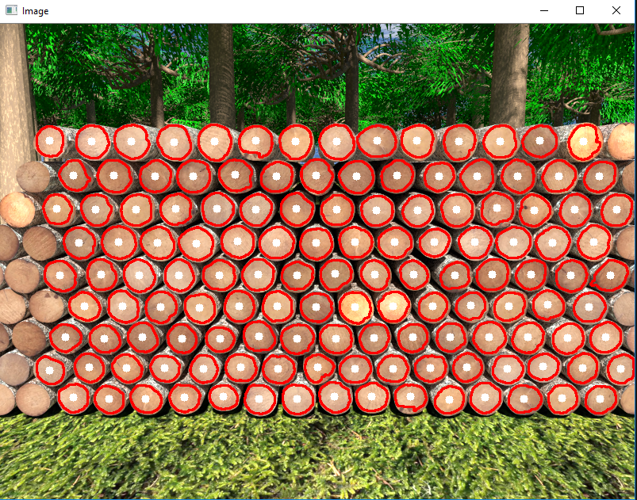

# Holistically-Nested Edge Detection with OpenCV and Deep Learning

Holistically-Nested Edge Detection (HED) attempts to address the limitations of the Canny edge detector through an end-to-end deep neural network.

This network accepts an RGB image as an input and then produces an edge map as an output. Furthermore, the edge map produced by HED does a better job preserving object boundaries in the image.

## What is Holistically-Nested Edge Detection?

The algorithm we’ll be using here today is from Xie and Tu’s 2015 paper, [Holistically-Nested Edge Detection](https://arxiv.org/abs/1504.06375) , or simply “HED” for short.

The work of Xie and Tu describes a deep neural network capable of automatically learning rich hierarchical edge maps that are capable of determining the edge/object boundary of objects in images.

This edge detection network is capable of obtaining state-of-the-art results on the [Berkely BSDS500](https://www2.eecs.berkeley.edu/Research/Projects/CS/vision/bsds/) and [NYU Depth datasets](https://cs.nyu.edu/~silberman/datasets/).

A full review of the network architecture and algorithm outside the scope of this post, so please refer to the [official publication](https://arxiv.org/abs/1504.06375) for more details.

## Holistically-Nested Edge Detection in Images

The Python and OpenCV Holistically-Nested Edge Detection example we are reviewing today is very similar to the [HED example in OpenCV’s official repo](https://github.com/opencv/opencv/blob/master/samples/dnn/edge_detection.py). Thanks to [pyimagesearch](https://www.pyimagesearch.com/), it show me for first time this architecture of Caffe Model and how can I use in my own projects. Also the features and explantation of it.

My primary contribution here is to:
1. Provide some addittional features and example of use it
2. Show you how to use Holistically-Nested Edge Detection to detect, segment and get edges of the timbers.

## Virtual Environment

To create the virtual environment, we have to have anaconda previously installed on our computer.

1. [Download anaconda](https://www.anaconda.com/download/)

Create the virtual environment using the * environment.yml * file (contains all the dependencies of conda and pip packages)

`conda env create --file environment.yml`

To activate the created environment

`activate hed`

To deactivate the current environment

`deactivate hed`

To update the environment with new dependencies (the current environment must be disabled)

`conda env update --file environment.yml`

For a quick execution of the files:

1. `python detect_edges_image.py --edge-detector hed_model --image images/IMG_1468.JPG`
2. `python intersection.py --image intersection_test.jpg`

## Real image and HED Results

### Raw

  

### Segment

### Hed

## Synthethics images and HED Results

### Raw

  

### Segment

### Hed

